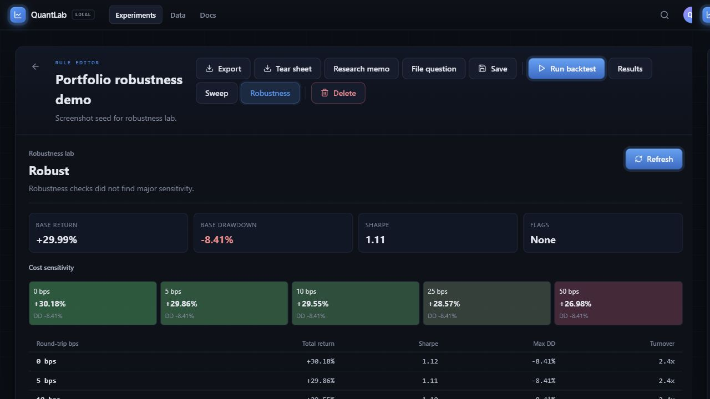

# Quant Lab

Interactive strategy research lab for retail investors to understand risk, overfitting, and regime dependence.

Quant Lab is not a stock predictor or trading bot. It is a local-first research cockpit for turning a strategy hypothesis into a backtest, stress test, robustness review, and research memo.



## Why This Exists

Most retail backtest tools make the headline return easy and the fragility hard to see. Quant Lab does the opposite: every result keeps assumptions, data provenance, drawdowns, costs, parameter sensitivity, start-date dependence, and failure modes close to the chart.

## What To Review First

1. Create or open an experiment.
2. Run a backtest.
3. Open `Results` to inspect metrics, drawdowns, fills, warnings, and deterministic review.
4. Open `Robustness` to run cost, start-date, and parameter sensitivity.
5. Export the Markdown tear sheet or write a wiki summary.

## Feature matrix

| Area | Status | Notes |
| --- | --- | --- |
| Experiment cockpit | Working | Create/import/export experiments with hypothesis, universe, dates, costs, cash policy, benchmark, and execution timing. |
| Strategy templates | Working | Buy and Hold, Moving Average Filter, Momentum Rotation. |
| Rule workbench | Working | Edit executable strategy blocks and inspect compiled JSON. |
| Backtest engine | Working | Deterministic target-weight interpreter, rebalance simulation, costs, slippage, fills, equity, drawdown, benchmark curve. |
| Diagnostics | Working | OOS analysis, rolling metrics, named regimes, portfolio risk, data reliability, provenance, deterministic quant review, bootstrap stress. |
| Robustness lab | Working | Cost sensitivity, start-date sensitivity, parameter sensitivity, and fragility verdict. |
| Research exports | Working | JSON export, Markdown tear sheet, wiki experiment summary, open question capture. |
| Portfolio polish | Working | README screenshot, feature matrix, known limits, agent docs, wiki updates. |
| Tests | Working | Python backend tests, TypeScript/Vite production build, frontend smoke script. |

## Architecture

```text
React/Vite UI
  -> src/api/experiments.ts
  -> FastAPI backend
  -> local JSON experiment store
  -> yfinance market data cache
  -> deterministic strategy interpreter/backtest engine
  -> diagnostics, robustness, exports, wiki outputs
```

Core backend modules:

- `backend/quant_lab/api.py` - FastAPI routes and dependency injection.
- `backend/quant_lab/domain.py` - dataclasses, enums, invariants, serialization.
- `backend/quant_lab/programs.py` - executable strategy blocks and interpreter.
- `backend/quant_lab/engine.py` - backtest orchestration.
- `backend/quant_lab/robustness.py` - cost/start-date/parameter sensitivity.
- `backend/quant_lab/wiki_exports.py` - tear sheets, wiki summaries, open questions.

## Known limits

- Local-first app: no auth, multi-user storage, or hosted deployment model.
- Market data uses yfinance cache; data quality and survivorship limits remain visible assumptions.
- Execution model is simplified: no taxes, borrow fees, liquidity constraints, partial fills, or broker routing.
- Custom rules are editable as executable blocks, but not yet a full natural-language strategy builder.
- Research memo export is Markdown, not polished PDF/share page.

## Knowledge base

This repo includes an LLM-maintained wiki pattern:

- `raw/` stores immutable source files.
- `wiki/` stores generated markdown pages.
- `wiki/index.md` is the content catalog.
- `wiki/log.md` is the append-only activity timeline.
- `AGENTS.md` defines ingest, query, and lint workflows for future agent sessions.

## Agent docs

Agent-readable technical documentation lives in `docs/`.

- `docs/index.md` is the docs catalog.
- `docs/llms.txt` is the compact agent manifest.

## Local development

Edit `.env` if you want custom ports.

Backend:

```bash
python -m uvicorn backend.main:app --host 127.0.0.1 --port 8011
```

Frontend:

```bash
pnpm dev -- --host 127.0.0.1 --port 5173
```

Verification:

```bash
python -m pytest
pnpm.cmd build
pnpm.cmd smoke:frontend
```

`smoke:frontend` expects backend and frontend already running at default local URLs.
