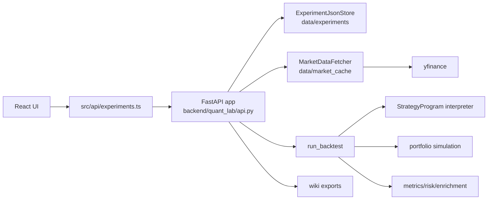

# Architecture

Quant Lab has React frontend, FastAPI backend, local JSON storage, yfinance market data cache, and agent-maintained wiki/docs layers.

## System Map

## Runtime Flow

1. Frontend calls `src/api/experiments.ts`.
2. FastAPI route parses/validates payload into domain dataclasses.
3. Experiments load/save through `ExperimentJsonStore`.
4. Run route builds symbol list from strategy universe plus benchmark.
5. `MarketDataFetcher` fetches/cache-loads yfinance OHLCV.
6. `run_backtest` interprets strategy blocks into target weights, simulates portfolio, computes metrics and warnings.
7. `result_enrichment` adds provenance, data reliability, quant review, bootstrap stress.
8. API serializes dataclasses through `to_primitive`.

## Directories

- `backend/quant_lab/` - API, domain model, engine, storage, data fetch, wiki export.
- `src/` - React UI, API client, styles.
- `tests/` - Python tests for domain, engine, market data, programs, run endpoint.
- `wiki/` - generated research/product knowledge base.
- `docs/` - agent-readable technical docs.
- `raw/` - immutable user source files.
- `data/` - runtime local storage and cache.

## Important Couplings

- Frontend `ExperimentSummary` type mirrors backend `Experiment` primitive shape.
- `strategy_program` is canonical executable strategy representation.
- `StrategyConfig.parameters` backs UI variant/sweep controls.
- `BacktestResult.config` and `.strategy` must match parent `Experiment`.
- Wiki summary endpoints depend on completed experiments with `result`.
